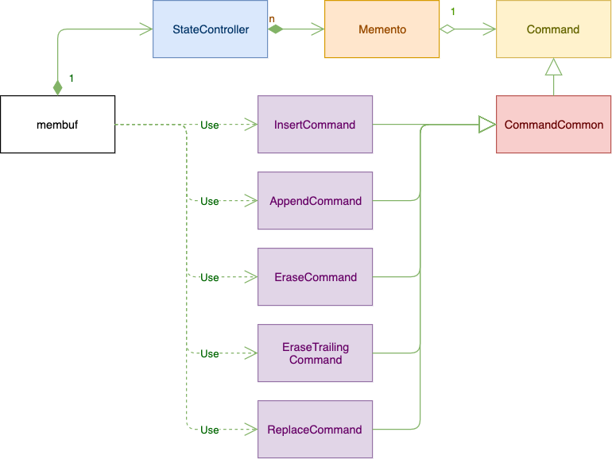

# Buffer Management

This is a C++ program that emulates buffer management found within many text editor.
It is an example of using design patterns Memento and Command. 

## 1. Requirements
##### 1.1 A text buffer to store text. 
##### 1.2 User can initialize the text buffer with some text.  [design](#constructor)/[test](#testundoredo)
##### 1.3 User can insert a substring at a position [design](#insert)/[test](#testinsert)
##### 1.4 User can append a substring to the existing text  [design](#append)/[test](#testappend)
##### 1.5 User can erase n characters at a given position [design](#erase)/[test](#testerase)
##### 1.6 User can erase n trailing characters from the existing text [design](#erasetrailing)/[test](#testerasetrailing)
##### 1.7 User can replace all occurrences of a substring with another one [design](#replace)/[test](#testreplace)
##### 1.8 User can undo the above operation(s) [design](#undo)/[test](#testundoredo)
##### 1.9 User can redo the above operation(s) [design](#redo)/[test](#testundoredo)
##### 1.10 User can save the text buffer content in to a txt file [design](#savefile)/[test](#testsaveread)
##### 1.11 User can load the content from a txt file [design](#readfile)/[test](testsaveread)
##### 1.12 User expects high efficiency in memory usage when there are many operations are made, and each involves only small changes. [design](#command)/[test](#testundoredo)

## 2. Design
Design patterns are used in the implementation. 

### 2.1 Design Patterns
#### 2.1.1 Memento
This design decision comes from Requirement 1.8 and 1.9. Memento can be used to manage states and history of operations.

#### 2.1.2 Command
This design decision can be linked to Requirement 1.12. Instead of storing the whole buffer before modification, we store the
command (operation) together with some necessary information for undo.

### 2.2 Implementation
#### 2.2.1 UML diagrams


#### 2.2.2 membuf
This is the main class that provides all the services. It delegates 5 of the services
to the corresponding concrete command objects.

Methods of this class:

##### Constructor <a id="constructor"></a>
Its constructor implements Requirement 1.2. It has a StateController (the CareTaker of
the Memento Design Pattern).

##### insert <a id="insert"></a>
This method implements Requirement 1.3. The operation is delegated to an InsertCommand.
To support undo/redo, the InsertCommand object is then pushed to the StateController.

##### append <a id="append"></a>
This method implements Requirement 1.4. The operation is delegated to an AppendCommand.
To support undo/redo, the AppendCommand is then pushed to the StateController.

##### erase <a id="erase"></a>
This method implements Requirement 1.5. The operation is delegated to an EraseCommand.
To support undo/redo, the EraseCommand is then pushed to the StateController.

##### erase_trailing <a id="erasetrailing"></a>
This method implements Requirement 1.6. The operation is delegated to an EraseTrailingCommand.
To support undo/redo, the EraseTrailingCommand is then pushed to the StateController.

##### replace <a id="replace"></a>
This method implements Requirement 1.7. The operation is delegated to a ReplaceCommand.
To support undo/redo, the ReplaceCommand is then pushed to the StateController.

##### uodo <a id="undo"></a>
This method implements Requirement 1.8. It calls the StateController to get the
previous Command. If there is a valid previous Command, it then calls the
Undo method of the Command to revert back to the previous state.

#### redo <a id="redo"></a>
This method implements Requirement 1.9. It calls the StateController to get the
next Command. If there is a valid next Command, it then calls the Execute
method of the Command to re-operate. 

##### save_file <a id="savefile"></a>
This method implements Requirement 1.10. 

##### read_file <a id="readfile"></a>
This method implements Requirement 1.11.

#### 2.2.3 StateController
This is the CareTaker of the Memento design pattern. It maintains a list of Mementos.
It also maintains a pointer to the current Memento. 

It includes these methods.

##### storeMemento
If the current Memento is the last one of the list, then just push the new one to the back of the list.

_Important_: What happens if the current one is not the last one? The requirement does
not specify what to do. 
The current implementation deletes everything behind the current one, and then push the
input Memento to the back.

##### getPrevious
Return the Memento before the current one. Update the current pointer.
If there is not previous, return NULL.

##### getNext
Return the next Memento if there is one. Update the current pointer.
If there not next, return NULL.

#### 2.2.4 Memento
This is the Memento class of the Memento design pattern. It contains a pointer
to a Command.

#### 2.2.5 Command <a id="command"></a>
This is the base class for the Command design pattern. It contains
two abstract method: Execute, and Undo.

#### 2.2.6 CommandCommon
This is a subclass of the Command class above. It is created for 
factorization. Note that the undo of insert is erase. So concrete
commands share common operations. 

#### 2.2.7 BufferCommands
It contains the following 5 concrete commands:
* InsertCommand
* AppendCommand
* EraseCommand
* EraseTrailingCommand
* ReplaceCommand

Each concrete command needs to implement the Execute and Undo methods.
The implementations of the first 4 concrete commands are pretty straightforward.

The most difficult one is the ReplaceCommand. More specifically, the Undo method
is the tough part. 

The following example is a special case that needs attention. Assume that
the original string is 


```
"apple orange apple orange". 
```
Now replace "apple" with "orange".
The Execute method is straightforward. It shall result in 
```
"orange orange orange orange". 
```
Then to undo, we can't just
replace all the "orange" back with "apple".

The problem here is that the original string can contain both the from_str("apple" here) and the to_str ("orange" here) 
before replacing from_str to to_str. 

The solution implemented here is to use a list of integer to store the index of the to_str in the
resulted string. For this example, for the 4 "orange" substrings, the second one and the last one 
were in the original string. So a list storing [2,4] is sufficient to store the information for the Undo
method.

Therefore, the Execute method of the ReplaceCommand shall generate this list when it is replacing.


## 3. Make
### Build
A Makefile was provided for building a static lib using g++. From a command line window:

```make```

Check membuf.a is there.

This has been tested on MacOS (10.15.2), and CentOS 9 (g++ 8.2.1). 

## 4. Usage
Link the static lib into your application. 
 
## 5. Test
Go to the test folder. There are two Makefiles, and a main.cpp file.

The [main.cpp](test/main.cpp) file contains all the unit tests for this static lib.
It has seven functions:
* TestInsert <a id="testinsert"></a>
* TestAppend <a id="testappend"></a>
* TestErase <a id="testerase"></a>
* TestEraseTrailing <a id="testerasetrailing"></a>
* TestSaveRead <a id="testsaveread"></a>
* TestUndoRedo <a id="testundoredo"></a>

These tests can all be linked back to the requirements.

### test only
Do this:

```
make
./test
```
If no assertion failure, all tests are passed.

### test with code coverage
Here gcov is used to collect code coverage data.

Do this:

```
make -f Makefile-cov
./test
```

Then to check the coverage for each file, do the followings. Here Memento.cpp
is used as an example.

```
gcov Memento.cpp
more Memento.cpp.gcov
```
The unit tests in main.cpp give 100% code coverage (line coverage).